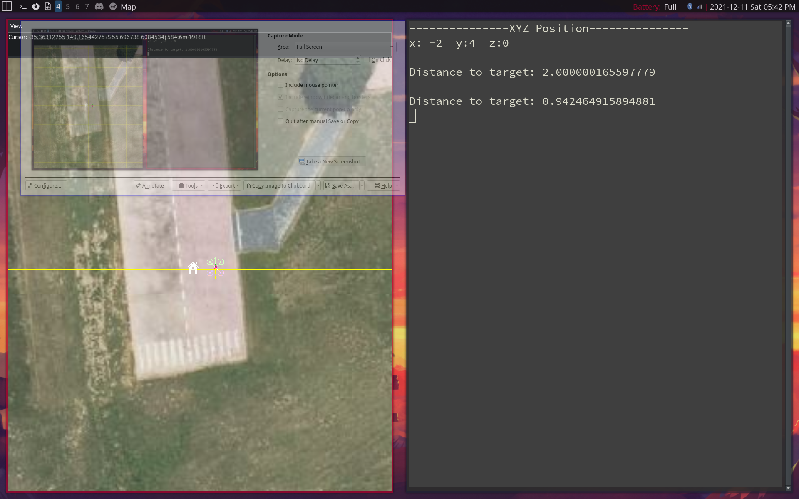

# Controlling Drone With Arrow Keys

We have now have a general interface to control a drone with our arrow keys. This has been tested in simulation,
however it is an imprecise solution since we're are doing a lot position calculations that have error. Sometimes
the drone will get stuck on the same distance metric (distance to target never decreases). As heuristic solution
we'll just break out of the travel loop if we've seen the same val 4 times (this is a horrible solution and we 
need velocity based movement to work to avoid this).

## Ncurses
The main file for this is `arrorkeymovement.py`. It provides a very basic cli using the ncurses library.
Ncurses is what allows us to control how the screen is drawn and detect and handle keyboard input. It prevents
echoing of input to the terminal. As well.

The cli just works off the arrow keys. It shows x,y,z coords relative to the drones locations at the start
of the program. Pressing the arrow keys moves you 2 meters in the desired direction.

The changes can be observed on the map when using `mavproxy` with the console and map switches.

## Dronekit
The `dronekit_basics.py` file is included in the main file and provides the API to control the drone. You should
review the functions in there if you want to understand the interface (its really rough now and is definitely not final).

1. First we connect to the using the `connectMyCopter()` function.
2. Then we call `arm_and_takeoff(<height>,<vehicle>)` where vehicle is the object returned by our connect function.
3. Then we start the cli.
4. within the cli when you press an arrow key we use the `goto(x,y,<vehicle>)` function to move the drone by a distance
specified relative to its current solution.

## Usage
1. First start the drone sim using `sim_vehicle.py --console --map -v ArduCopter`
2. Then start the cli using `python arrowkeymovement.py --connect 127.0.0.1:14550`

