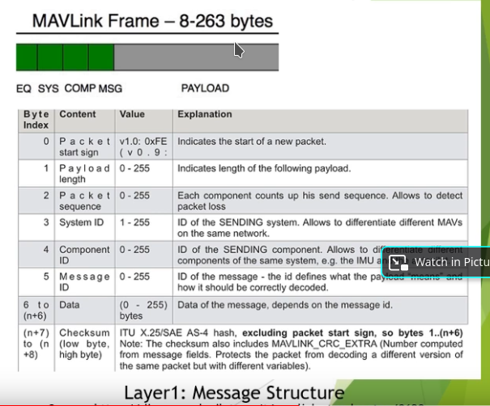
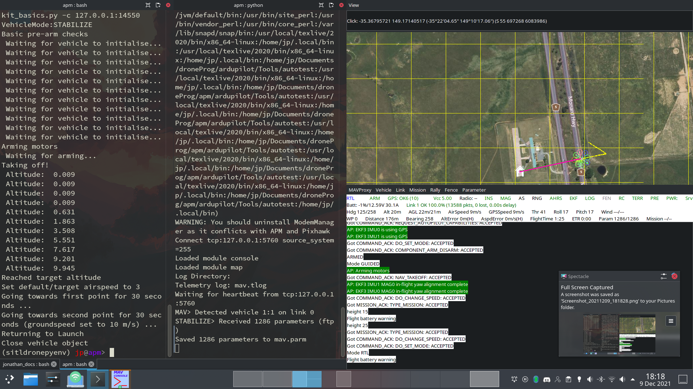

# Drone Programming

## Flight Stack
1. Flight control software (firmware)
2. Flight control hardware (autopilot)
3. Drone Hardware (motors, escs, etc)

### GCS (our laptop in this case)
1. software (mavproxy, mission planner)
2. hardware

SITL = software in the loop (software drone)

MAVLINK = as we know the comm protocol for controlling the autopilot (Pixhawk in our case)

Dronekit: python lib to control with mavlink (mavproxy is a dependency)

## Ardupilot
PX4 = software
Pixhawk = open source hardware

The `waf` tool located in the root of the ardu pilot repo is used to compile the ardupilot code.

## Building the virtual drone
First you must have the ardupilot repo on your system `git clone https://github.com/ArduPilot/ardupilot.git` (just go with the latest one)

You can build the SITL drone with the `sim_vehicle.py` file located in `Tools/autotest` dir of the repo.

You can specify the vehicle type to build either by being in the relevent vehicle dir in the root of the repo (arducopter dir for us)
or by specify the vehicle type using the `--vehicle` options. We want the arducopter `--vehicle ArduCopter`.

Build with `sim_vehicle.py --console --map --vehicle ArduCopter`

Then we have a few python dependencies. It will tell you to install most of them. Just use `python -m pip install <module name>`.

It will probably not warn you about not having the `future` lib installed. Just run `python -m pip install future`.

Once all libs are installed just run the build command again.

## Running the virtual drone
You need mavproxy `pip install mavproxy` I would suggest setting up a python virtual enviroment because there are a few
dependencies to install. 
1. `pip install numpy`
2. `pip install wxPython` (this will take a while because it has to build from source -\_-)
3. `pip install opencv-python`
4. `pip install matplotlib`

## Mavlink

System Id is typically 255 for GCS and 1 for drone.

Mavproxy is our abstraction layer for Mavlink. We dont want to craft messages by hand so mavproxy can do it
for us instead.

A list of mavlink commands can be found here (https://mavlink.io/en/messages/common.html)

## Dronekit
Provides a list of mavlink empowered functions (allows us to treat our drone like an API and control it from python).

### Program to takeoff, fly to waypoint, and land
```python
Vehicle.arm_and_takeoff(10)
Vehicle.simple_goto(waypoint)
time.sleep(10) # wait for movement to complete
Vehicle.mode("LAND")
```

I've copied down the basic "connect to vehicle" code and put it in the repo.


## Velocity based movement
This is a basic way to control the drone. Send it a command to set velocity in x or y.

These commands must be resent every 1 sec to maintain constant motion.

The dronekit basics file contains a lot of starter code for basic take off and goTo type stuff. I could not get the
velocity based movement to work in simulation, but that will be our prefered mode of nav in realworld.

# Start  sim and run dronekit script
1. `sim_vehicle.py --console --map --vehicle ArduCopter` This should allow for connection at address 127.0.0.1:14550
2. `python dronekit_basics.py -c 127.0.0.1:14550` This command should takeoff and move to 2 points before returning home and landing.
You should be able to observe takeoff and landing in the map provided by mav proxy.


