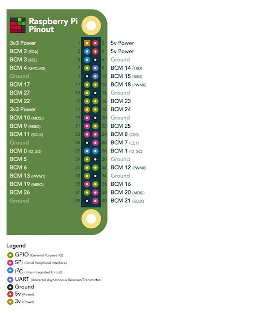

# Mavproxy Setup Process
Shell cmds for dependcies (dont forget to `sudo apt update` first).
```
sudo apt-get install python3-dev python3-opencv python3-wxgtk4.0 python3-pip python3-matplotlib python3-lxml python3-pygame
pip3 install PyYAML mavproxy --user
echo "export PATH=$PATH:$HOME/.local/bin" >> ~/.bashrc
```

### Disable serial port for OS and enable in hardware
`sudo raspi-config` to open config wizard. Go to Interfacing option->serial->
1.  select `no` to “Would you like a login shell to be accessible over serial?”.
2. select `yes` to “Would you like the serial port hardware to be enabled?”.

Wi-fi is already configured to connect to my hotspot on boot, but it would probably be a good idea to setup an hotspot
on the RPI itself so we can connect to it instead of waiting for it to connect to us.

# Connecting Pixhawk to serial int
We'll connect to pins 4,6,8, and 10 on the RPI
|PIN#|Purpose|
--|--
|2|Power 5V|
|6|Ground|
|8|TX (Transmit goes to receive on Pixhawk)|
|10|RX (Receive goes to transmit on Pixhawk)|

## Telem Port Pinout
Pin |	Signal |	Volt|
|--|--|--|
|1 (red) 	|VCC |	+5V
|2 (blk) 	|TX (OUT) |	+3.3V
|3 (blk) 	|RX (IN) |	+3.3V
|4 (blk) 	|CTS |	+3.3V
|5 (blk) 	|RTS 	|+3.3V
|6 (blk) |	GND |	GND


## RPI Pinout


## Getting a Mavproxy shell
The command to open mav proxy connection should be `python3 mavproxy.py --master=/dev/serial0 --baudrate 921600 --aircraft <directory path where logs will be saved>`, since we will be
setting up the connection on serial0. Also the baudrate might be optional as mavproxy states that it should detect it automatically.

Looks like we can use `[` then a label or property to echo it to cmdline.

In out current it looks like all the mavproxy files and run when called. Command to open sessions is just
`mavproxy.py --master=/dev/serial0 --baudrate <baudrate> --aircraft <directory path where logs will be saved>`

baud rate as of writing this is set to 576600 but we can change it as needed through mission planner.
## Pixhawk firmware
We installed fmuv2 firmware in mission planner

We set firmware params and saved file in git root
```
SERIAL2_PROTOCOL = 2 (the default) to enable MAVLink 2 on the serial port.
SERIAL2_BAUD = 921 so the flight controller can communicate with the RPi at 921600 baud.
LOG_BACKEND_TYPE = 3 if you are using APSync to stream the dataflash log files to the RP
```
