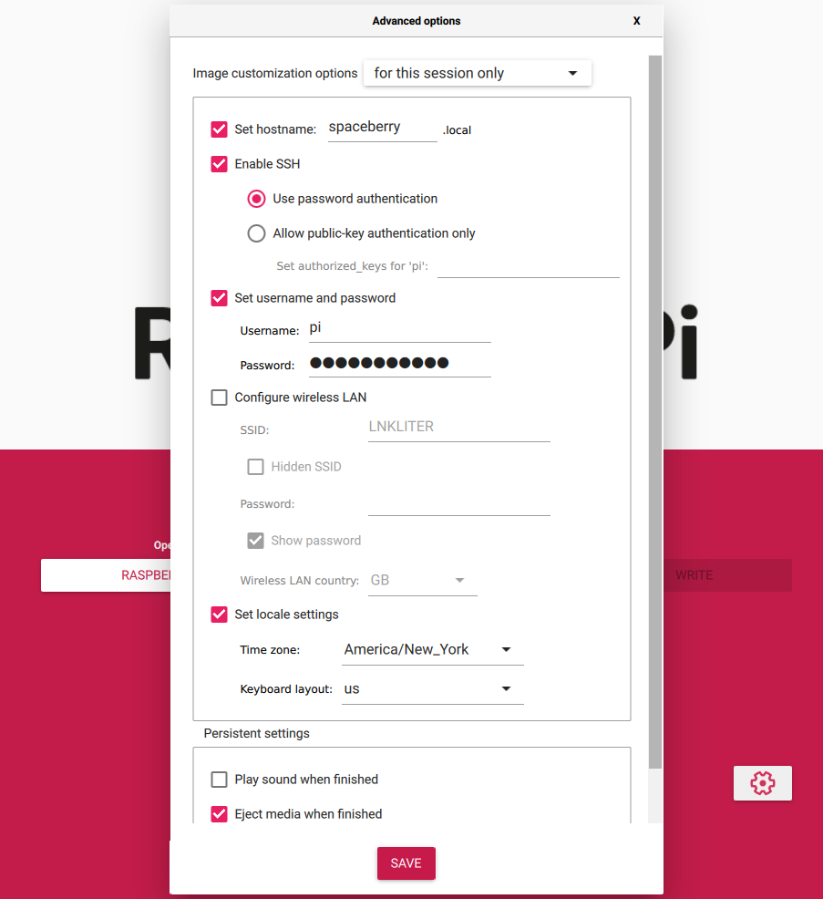
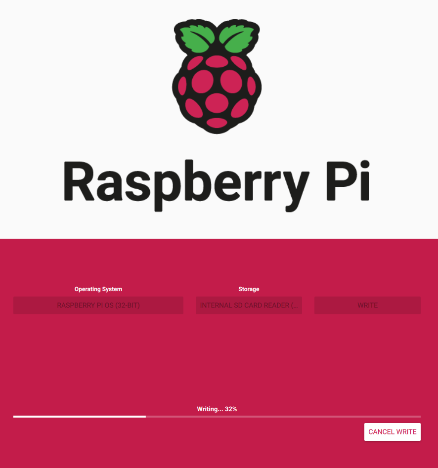
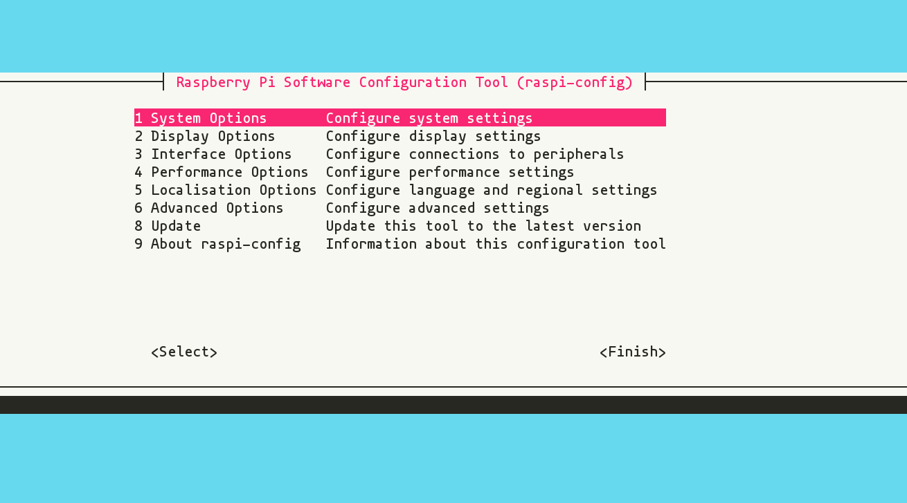
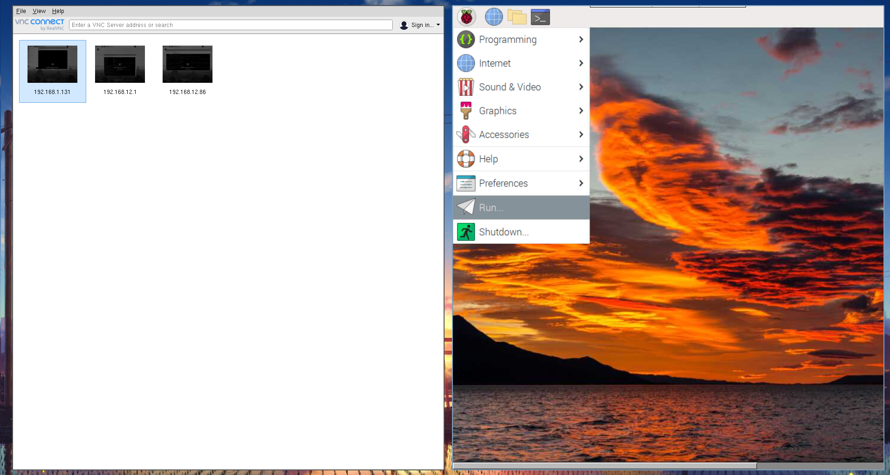

# Raspberry Pi Initial setup
## Install
- First download rpi imager from [https://www.raspberrypi.com/software/](https://www.raspberrypi.com/software/)

- With the SD card plugged in start the rpi-imager and select the appropriate storage (SD card) and OS (Raspberry Pi OS 32-bit)

- Click the cog wheel in the bottom left to customize image options. You should enable ssh and set a username and password in the below example. If you set these options you can skip the **Enable SSH on boot** section.



- click **Write** and wait for installer to complete



## Enable SSH on boot (only if you didn't set installer options)
We need to enable SSH on boot because we don't want to deal with hooking up an external monitor and what not so we need create an empty "ssh" file in the boot dir
of the SD Card.

1. With the SD card plugged in navigate to it in file explorer or the terminal.
2. In the root of the SD card create a new empty file labeled **ssh**. In file explorer you can right click -> create new. Make sure your creating an empty file, not an empty text file. If it has the notepad icon your probably wrong. On a unix terminal you can just use the `touch` command as shown below.
```
jp@~> sudo mount /dev/mmcblk0p2 /mnt
mount: /mnt: /dev/mmcblk0p2 already mounted on /mnt.
jp@~> ls /mnt
bin   dev  home  lost+found  mnt  proc  run   srv  tmp  var
boot  etc  lib   media       opt  root  sbin  sys  usr
jp@~> sudo touch /mnt/ssh      
jp@~> ls /mnt
bin   dev  home  lost+found  mnt  proc  run   srv  tmp  var
boot  etc  lib   media       opt  root  sbin  sys  usr ssh
```

## Connecting to the RPI
I'm going to assume that you have the RPI connected to your local router, either by ethernet cable or because you set the option in the installer to specify a network/password. To ssh into the RPI to configure it further you need to know its IP address. If you have access to your routers GUI you can look at clients that an IP and get it that way. I usually just use the `nmap` scanner to scan my network to find the ip.
```
sudo nmap <your network address>/24
```
Once you have the ip you can ssh into the pi with the username and password you set previously. If you didn't set a password the default user is **pi** and password is **raspberry**.
```
ssh <username on pi>@<pi ip address>
```

## Further Configuration
SSH into the rpi and you should be greeted with the following prompt.
```
pi@spaceberry:~ $ 
```
Enter
```
pi@spaceberry:~ $ sudo raspi-config
```
To bring up the config tool


Were going to enable a few things.
- VNC Server: Interface Options -> VNC -> Enable
- Serial Interface: Interface Options -> Serial Port -> login shell = NO -> Hardware = YES

After these are set when prompted to reboot select yes.

## VNC Viewer
This is the standard remote desktop software to use with the RPI it can be downloaded [here](https://www.realvnc.com/en/connect/download/viewer/windows/)

VNC Server has already been enable on the RPI so you can connect to by opening VNC and typing in the RPI's IP address in the bar at the top.



You can do everything from gui if you want to. For anything requiring a terminal just open one in the VNC window. A direct SSH connection will be more responsive however since a full gui is going to be network intensive.

## Setting Up Python
Most of this project uses python libraries. Were going to setup whats called a python virtual environment. We install packages inside this environment this allows use to more easily keep track of our dependencies for the project.

First we going to install some text editors. Vim for cmdline, Gedit for graphical.
```
sudo apt install vim
sudo apt install gedit
```

Were going to create directory for our python environments
```
pi@spaceberry:~ $ mkdir pyenvs
```
Then were going to create the env
```
pi@spaceberry:~ $ cd pyenvs
pi@spaceberry:~/pyenvs $ python -m venv spacedrones
pi@spaceberry:~ $ ls pyenvs/
spacedrones
```
Were going to use a small script to activate our pyenv
```bash
#!/bin/bash
# Usage: . ./pynv <pyenv name>
# This script with search an expected directory for a python virtual
# enviroment named by the first argument.
# To use the env in your current shell you must specify the shell is
# to run in your current instance and not forked. To specify this
# behavior run ". pynv.sh <env name>"

actLocation="/home/pi/pyenvs/$1/bin/activate"

if [[ -f $actLocation ]]; then
  source "$actLocation";
  echo "Info: $1 pyenv activated";
else
  echo "Error: pyenv activation file not found at $actLocation";
fi
```

Were just going to run this command each time we open a shell so were always in our spacedrones pyenv. We can always type deactivate to get into our global enviroment.

Well add the following to our bashrc
```bash
alias pynv=". /home/pi/.jerryscripts/pynv.sh"
# Enter the spacedrones pyenv
pynv spacedrones
```

We can also use it manually as follows
```bash
pi@spaceberry:~ $ pynv spacedrones
Info: spacedrones pyenv activated
(spacedrones) pi@spaceberry:~ $ deactivate
pi@spaceberry:~ $ 
```

You done really need to think about this at all just when you login you should see the prompt as follows
```
(spacedrones) pi@spaceberry:~ $
```
which indicates your in the correct environment.

You should regularly record the packages in the environment by outputting them to a text file. `pip freeze > requirements.txt`.

## Setting Remote Access
Were going to use [this](https://github.com/lakinduakash/linux-wifi-hotspot) application to enable remote access to the rpi. You can install it using the instructions provided, and use the directions to set it to start automatically. Then to connect to the PI you simply need to connect to its wireless network. I've name the SSID the same as the computer name "spaceberry".
