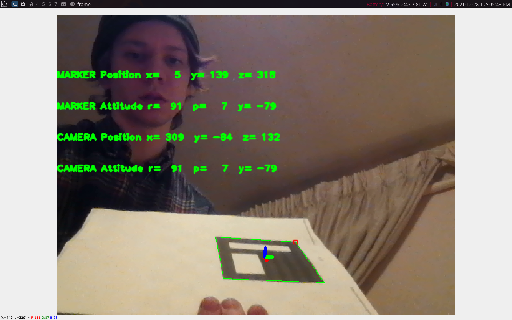

# camCalib Notes
### Created: 2021-December-28

Directions taken from `https://docs.opencv.org/3.0-beta/doc/py_tutorials/py_calib3d/py_calibration/py_calibration.html#calibration`

Calibrating the camera accounts for distorition that is present in every camera. We account for distortion by
finding 5 distortion coeffecients.

The camera matrix is a collection of intrinic properties of the camera such as focal length.

We need 10 patterns at least to find all this information.

For calibration we need a set of 3D real world points and a set of corresponding 2D image points. In the case of
our checker board the 2D image points are the points where 2 black squares touch. The 3D points will be taken from
our pictures.

- 3D points = object points
- 2D points = image points

Completed the cameraCalibration script `camCalib.py` and tested it after porting the `lib_aruco_pose.py` script to python3.
