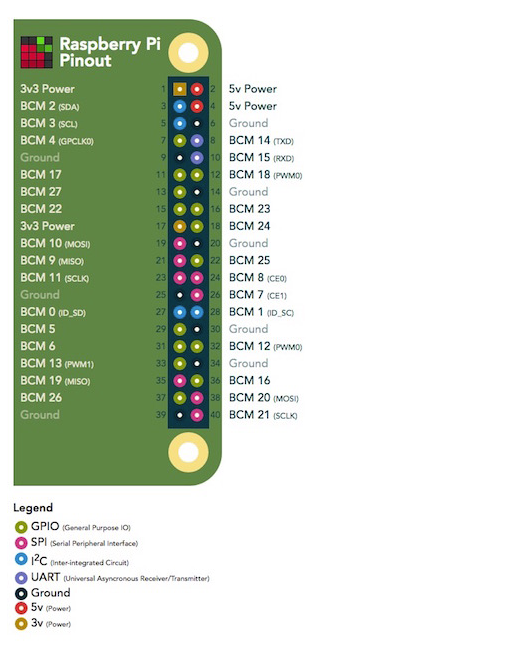

# HRC04 Sensor Integration

## RPI GPIO Pinout

## Wiring
VCC: red \
Trig: blue\
Echo: yellow\
Grnd: black

##Pin mapping
VCC: pin 2\
gnd: pin 6\
trig: pin 16 (BCM 23 so trig pin is 23 in code)\
echo: pin 18 (BCM 24 so echo is 24 in code)\

A 1k resistor sits between the echo pin and the rpi pin 18

